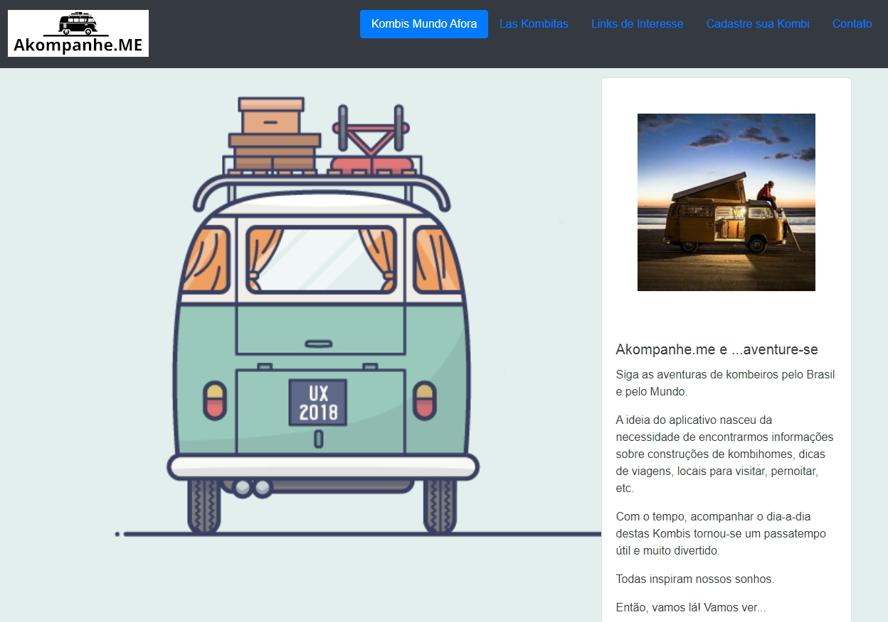

# Akompanhe.me

Criação de página agregadora com Flask
Ferramentas utilizadas:

    - Python
    
    - Flask
    
    - HTML
    
    - Bootstrap
    
O objetivo da página é agregar os canais de proprietários de Kombihomes tornando a busca e o acompanhamento destes canais mais fácil e rápido. 
