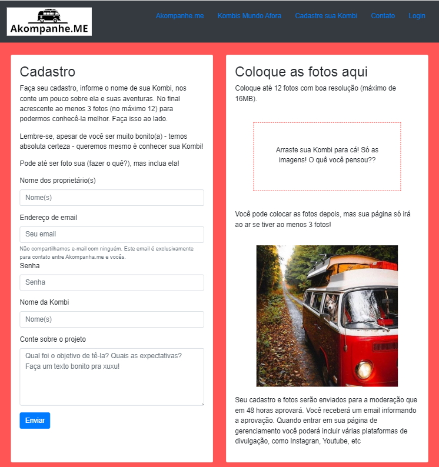

# Akompanhe.me

Criação de página agregadora com Flask.
Ferramentas utilizadas:

    - Python
    
    - Flask (várias extensões)
    
    - HTML
    
    - Bootstrap e CSS

    
O objetivo da página é agregar os canais de proprietários de Kombihomes tornando a busca e o acompanhamento destes canais mais fácil e rápido. 

Abaixo, página de cadastro com formulário e drop de fotos.

Página em construção (sem deploy).

# Funcionalidades a serem implementadas
- cadastro de kombihomes com carregamento de fotos (em contrução)
- carregamento automático dos profiles na página de apresentação
- páginas de profile com carrossel das imagens
- link aos canais sociais de cada profile
- Database (Mongo ou SQLite)
